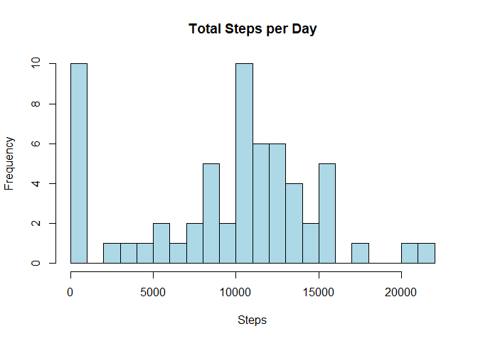
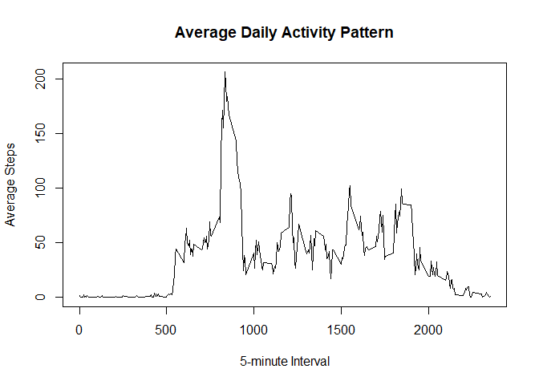
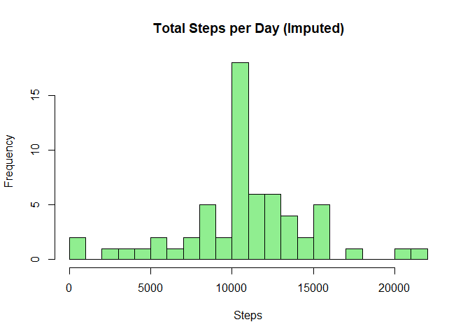
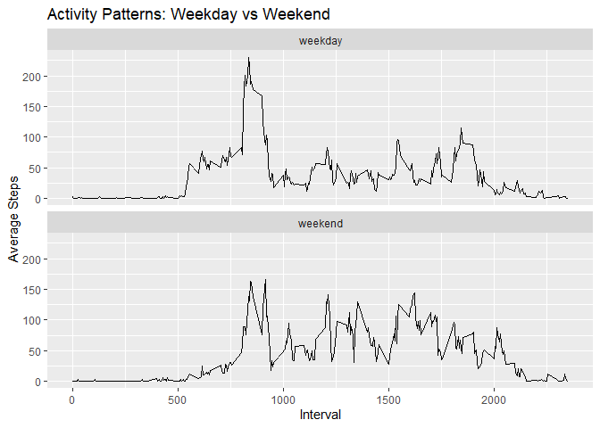

## Introduction

This project analyzes personal activity data collected at 5-minute
intervals over two months (October–November 2012). The dataset contains
the number of steps taken per interval, allowing us to explore daily
activity patterns, missing data, and differences between weekdays and
weekends.

------------------------------------------------------------------------

## Loading and Preprocessing the Data

    # Load required libraries
    library(dplyr)

    ## Warning: package 'dplyr' was built under R version 4.3.3

    ## 
    ## Attaching package: 'dplyr'

    ## The following objects are masked from 'package:stats':
    ## 
    ##     filter, lag

    ## The following objects are masked from 'package:base':
    ## 
    ##     intersect, setdiff, setequal, union

    library(ggplot2)

    # Load dataset
    data <- read.csv("activity.csv")
    data$date <- as.Date(data$date)

    # View structure
    str(data)

    ## 'data.frame':    17568 obs. of  3 variables:
    ##  $ steps   : int  NA NA NA NA NA NA NA NA NA NA ...
    ##  $ date    : Date, format: "2012-10-01" "2012-10-01" ...
    ##  $ interval: int  0 5 10 15 20 25 30 35 40 45 ...

    # -------------------------------
    # Mean Total Steps Per Day
    # -------------------------------

    steps_per_day <- data %>%
      group_by(date) %>%
      summarise(total_steps = sum(steps, na.rm = TRUE))

    # Histogram

    hist(steps_per_day$total_steps,
         main="Total Steps per Day",
         xlab="Steps",
         col="lightblue",
         breaks=20)

    # Mean and Median

    mean_steps <- mean(steps_per_day$total_steps)
    median_steps <- median(steps_per_day$total_steps)

    mean_steps

    ## [1] 9354.23

    median_steps

    ## [1] 10395

    # -------------------------------
    # Average Daily Activity Pattern
    # -------------------------------

    interval_avg <- data %>%
      group_by(interval) %>%
      summarise(avg_steps = mean(steps, na.rm = TRUE))

    # Time series plot

    plot(interval_avg$interval, interval_avg$avg_steps,
         type="l",
         xlab="5-minute Interval",
         ylab="Average Steps",
         main="Average Daily Activity Pattern")

    # Interval with max steps

    max_interval <- interval_avg[which.max(interval_avg$avg_steps),]
    max_interval

    ## # A tibble: 1 × 2
    ##   interval avg_steps
    ##      <int>     <dbl>
    ## 1      835      206.

    # -------------------------------
    # Missing Values

    missing_values <- sum(is.na(data$steps))
    missing_values

    ## [1] 2304

    # -------------------------------
    # Imputation Strategy
    # -------------------------------
    interval_means <- interval_avg

    data_imputed <- merge(data, interval_means, by="interval")

    data_imputed$steps[is.na(data_imputed$steps)] <- 
      data_imputed$avg_steps[is.na(data_imputed$steps)]

    data_imputed <- data_imputed[, c("steps", "date", "interval")]

    # -------------------------------
    # Histogram After Imputation
    # -------------------------------

    steps_per_day_imputed <- data_imputed %>%
      group_by(date) %>%
      summarise(total_steps = sum(steps))

    hist(steps_per_day_imputed$total_steps,
         main="Total Steps per Day (Imputed)",
         xlab="Steps",
         col="lightgreen",
         breaks=20)

    # Mean and Median after imputation

    mean_imputed <- mean(steps_per_day_imputed$total_steps)
    median_imputed <- median(steps_per_day_imputed$total_steps)

    mean_imputed

    ## [1] 10766.19

    median_imputed

    ## [1] 10766.19

    # -------------------------------
    # Weekday vs Weekend Analysis
    # -------------------------------

    data_imputed$day_type <- ifelse(weekdays(data_imputed$date) %in% 
                                     c("Saturday", "Sunday"),
                                   "weekend", "weekday")

    data_imputed$day_type <- as.factor(data_imputed$day_type)

    interval_daytype <- data_imputed %>%
      group_by(interval, day_type) %>%
      summarise(avg_steps = mean(steps))

    ## `summarise()` has grouped output by 'interval'. You can override using the
    ## `.groups` argument.

    ggplot(interval_daytype, aes(x=interval, y=avg_steps)) +
      geom_line() +
      facet_wrap(~day_type, ncol=1) +
      labs(title="Activity Patterns: Weekday vs Weekend",
           x="Interval",
           y="Average Steps")

\##Conclusion

Daily step counts vary across days. A specific 5-minute interval shows
peak activity. Missing values affect total step calculations. Imputation
improves estimates. Weekday and weekend activity patterns differ.
